### Escuela Colombiana de Ingeniería
### Arquitecturas de Software - ARSW
### 🔥Carlos Orduz Laura Valentina Alvarado

## Escalamiento en Azure con Maquinas Virtuales, Sacale Sets y Service Plans

### Dependencias
* Cree una cuenta gratuita dentro de Azure. Para hacerlo puede guiarse de esta [documentación](https://azure.microsoft.com/es-es/free/students/). Al hacerlo usted contará con $100 USD para gastar durante 12 meses.

### :white_check_mark: Parte 0 - Entendiendo el escenario de calidad

Adjunto a este laboratorio usted podrá encontrar una aplicación totalmente desarrollada que tiene como objetivo calcular el enésimo valor de la secuencia de Fibonnaci.

**Escalabilidad**
Cuando un conjunto de usuarios consulta un enésimo número (superior a 1000000) de la secuencia de Fibonacci de forma concurrente y el sistema se encuentra bajo condiciones normales de operación, todas las peticiones deben ser respondidas y el consumo de CPU del sistema no puede superar el 70%.

### :white_check_mark: Parte 1 - Escalabilidad vertical

1. Diríjase a el [Portal de Azure](https://portal.azure.com/) y a continuación cree una maquina virtual con las características básicas descritas en la imágen 1 y que corresponden a las siguientes:
    * Resource Group = SCALABILITY_LAB
    * Virtual machine name = VERTICAL-SCALABILITY
    * Image = Ubuntu Server 
    * Size = Standard B1ls
    * Username = scalability_lab
    * SSH publi key = Su llave ssh publica

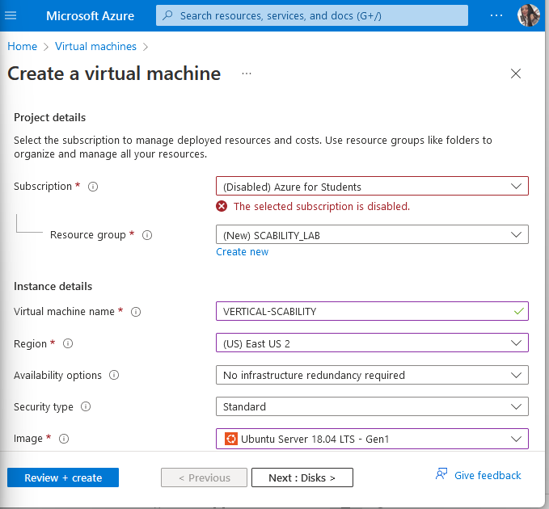

2. Para conectarse a la VM use el siguiente comando, donde las `x` las debe remplazar por la IP de su propia VM (Revise la sección "Connect" de la virtual machine creada para tener una guía más detallada).

    `ssh -i ~/Downloads/VERTICAL_LAB_KEY.pem scalability_lab@20.232.117.34`
    
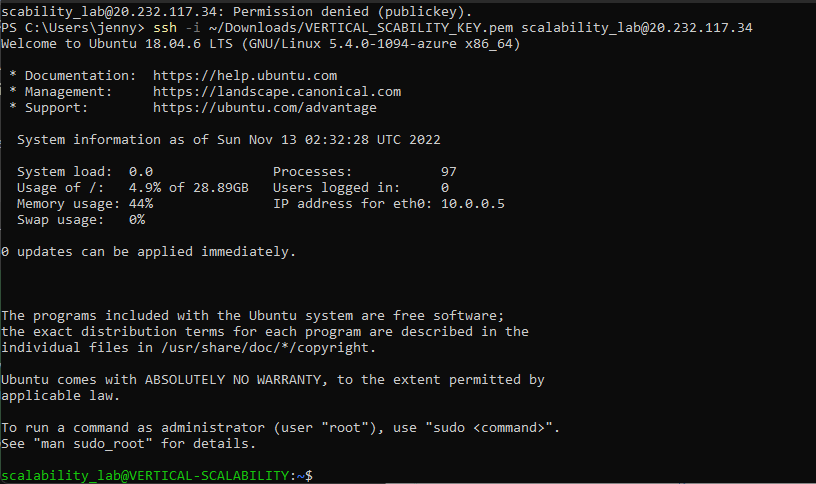

3. Instale node, para ello siga la sección *Installing Node.js and npm using NVM* que encontrará en este [enlace](https://linuxize.com/post/how-to-install-node-js-on-ubuntu-18.04/).

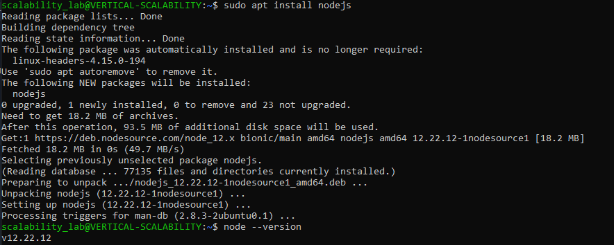

5. Para instalar la aplicación adjunta al Laboratorio, suba la carpeta `FibonacciApp` a un repositorio al cual tenga acceso y ejecute estos comandos dentro de la VM:

    `git clone <your_repo>`

    `cd <your_repo>/FibonacciApp`

    `npm install`

5. Para ejecutar la aplicación puede usar el comando `npm FibinacciApp.js`, sin embargo una vez pierda la conexión ssh la aplicación dejará de funcionar. Para evitar ese compartamiento usaremos *forever*. Ejecute los siguientes comando dentro de la VM.

    ` node FibonacciApp.js`
    
#### :computer: Endpoint

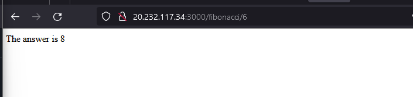

7. La función que calcula en enésimo número de la secuencia de Fibonacci está muy mal construido y consume bastante CPU para obtener la respuesta. Usando la consola del Browser documente los tiempos de respuesta para dicho endpoint usando los siguintes valores:
    * 1000000
    * 1010000
    * 1020000
    * 1030000
    * 1040000
    * 1050000
    * 1060000
    * 1070000
    * 1080000
    * 1090000    

📃**observarlos en el siguiente:** [informe](https://github.com/lauraval19/LAB09ARSW/blob/master/Preguntas.pdf)

8. Dírijase ahora a Azure y verifique el consumo de CPU para la VM. (Los resultados pueden tardar 5 minutos en aparecer).

:chart_with_upwards_trend: Consumo en CPU

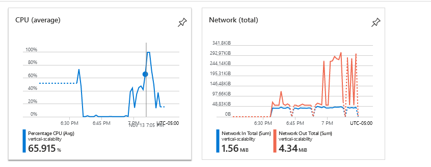

9. Ahora usaremos Postman para simular una carga concurrente a nuestro sistema. Siga estos pasos.
    * Instale newman con el comando `npm install newman -g`. Para conocer más de Newman consulte el siguiente [enlace](https://learning.getpostman.com/docs/postman/collection-runs/command-line-integration-with-newman/).
    * Diríjase hasta la ruta `FibonacciApp/postman` en una maquina diferente a la VM.
    * Para el archivo `[ARSW_LOAD-BALANCING_AZURE].postman_environment.json` cambie el valor del parámetro `VM1` para que coincida con la IP de su VM.
    * Ejecute el siguiente comando.

    ```
    newman run ARSW_LOAD-BALANCING_AZURE.postman_collection.json -e [ARSW_LOAD-BALANCING_AZURE].postman_environment.json -n 10 &
    newman run ARSW_LOAD-BALANCING_AZURE.postman_collection.json -e [ARSW_LOAD-BALANCING_AZURE].postman_environment.json -n 10
    ```
    
:soon: Peticiones con postman

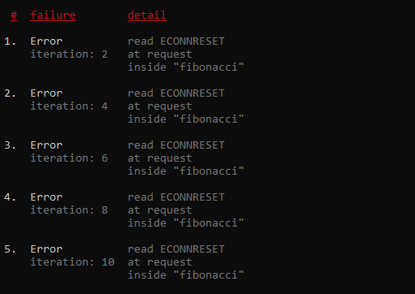

## ⚠️ Respuesta, análisis e imagenes de evidencia y preguntas: ⚠️ [informe](https://github.com/lauraval19/LAB09ARSW/blob/master/Preguntas.pdf)

### :white_check_mark: Parte 2 - Escalabilidad horizontal

#### Crear el Balanceador de Carga

Antes de continuar puede eliminar el grupo de recursos anterior para evitar gastos adicionales y realizar la actividad en un grupo de recursos totalmente limpio.

1. El Balanceador de Carga es un recurso fundamental para habilitar la escalabilidad horizontal de nuestro sistema, por eso en este paso cree un balanceador de carga dentro de Azure tal cual como se muestra en la imágen adjunta.

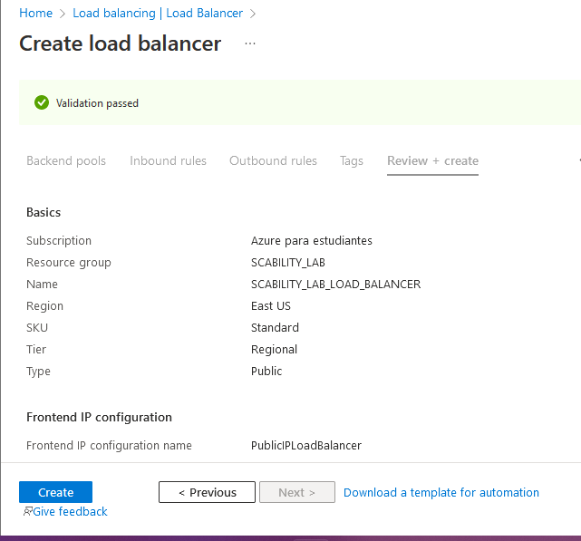

2. A continuación cree un *Backend Pool*, guiese con la siguiente imágen.


3. A continuación cree un *Health Probe*, guiese con la siguiente imágen.

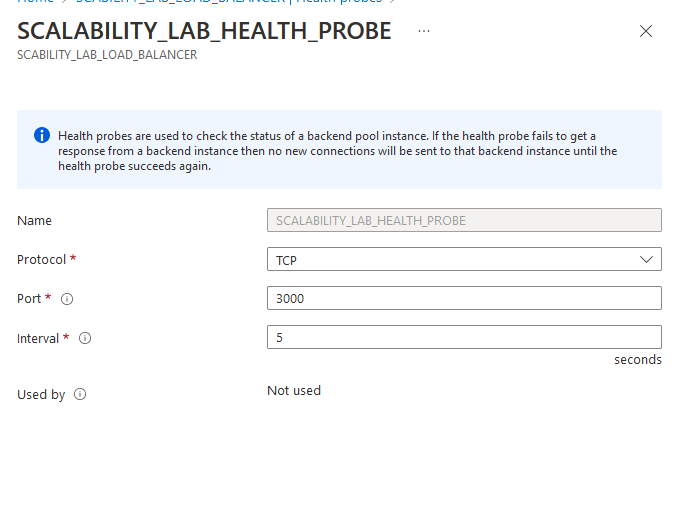

4. A continuación cree un *Load Balancing Rule*, guiese con la siguiente imágen.

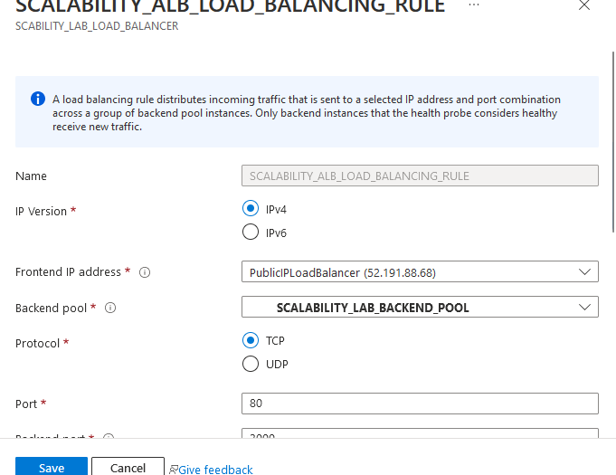

5. Cree una *Virtual Network* dentro del grupo de recursos, guiese con la siguiente imágen.


#### Crear las maquinas virtuales (Nodos)

Ahora vamos a crear 3 VMs (VM1, VM2 y VM3) con direcciones IP públicas standar en 3 diferentes zonas de disponibilidad. Después las agregaremos al balanceador de carga.

1. En la configuración básica de la VM guíese por la siguiente imágen. Es importante que se fije en la "Avaiability Zone", donde la VM1 será 1, la VM2 será 2 y la VM3 será 3.

2. En la configuración de networking, verifique que se ha seleccionado la *Virtual Network*  y la *Subnet* creadas anteriormente. Adicionalmente asigne una IP pública y no olvide habilitar la redundancia de zona.

3. Para el Network Security Group seleccione "avanzado" y realice la siguiente configuración. No olvide crear un *Inbound Rule*, en el cual habilite el tráfico por el puerto 3000. Cuando cree la VM2 y la VM3, no necesita volver a crear el *Network Security Group*, sino que puede seleccionar el anteriormente creado.

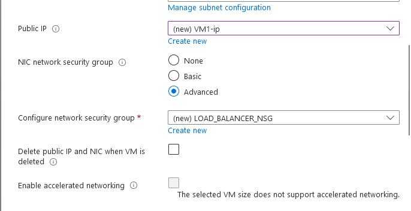

#### ✅ Probar el resultado final de nuestra infraestructura

1. Porsupuesto el endpoint de acceso a nuestro sistema será la IP pública del balanceador de carga, primero verifiquemos que los servicios básicos están funcionando, consuma los siguientes recursos:

```
http://52.155.223.248/
http://52.155.223.248/fibonacci/1
```
### 🖥️ Verficación servicios básicos

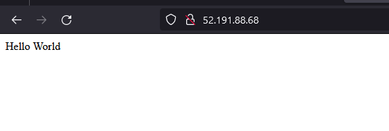

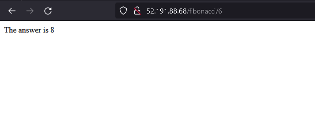

## ⚠️ Respuesta, análisis e imagenes de evidencia de 3 MV's y preguntas: ⚠️ [informe](https://github.com/lauraval19/LAB09ARSW/blob/master/Preguntas.pdf)


